# Practica03-JavaScript
<strong>•CAPTURAS DEL CODIGO HTML DE LA CALCULADORA</strong> 
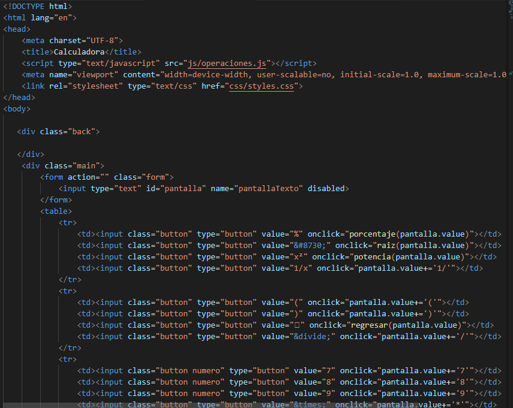 
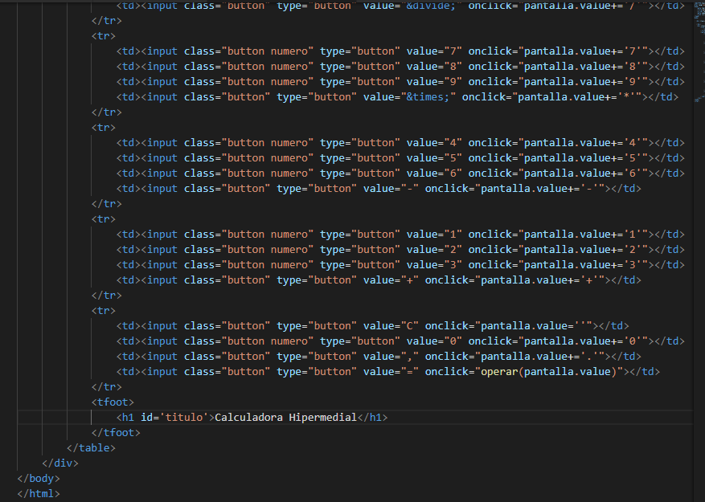 
<strong>•CAPTURAS DEL CODIGO JAVASCRIPT DE LA CALCULADORA</strong> 
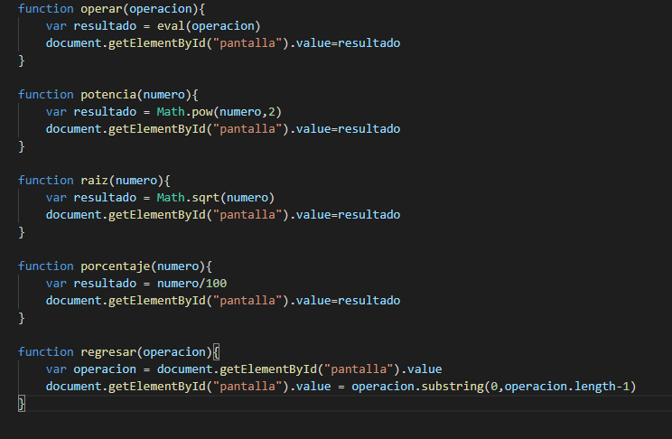 
<strong>•RESULTADO FINAL DE LA CALCULADORA</strong> 
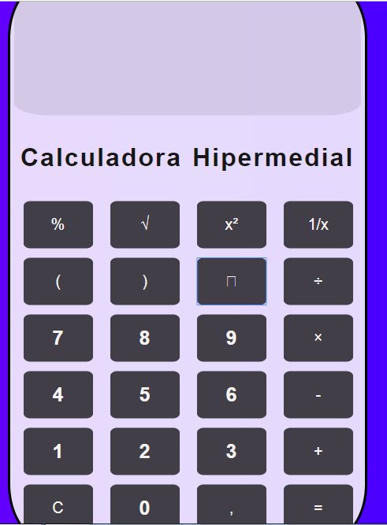 
<strong>•</strong> 
<strong>•CAPTURAS DEL CODIGO HTML DE LA VALIDACION</strong> 
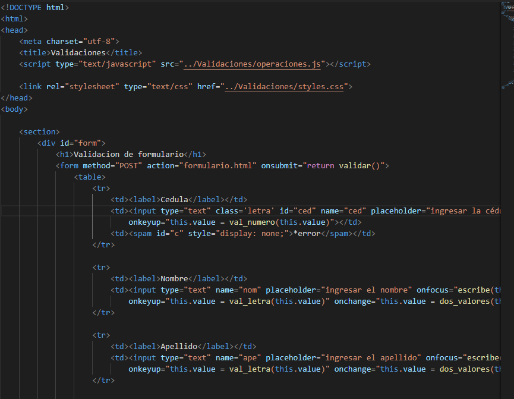 
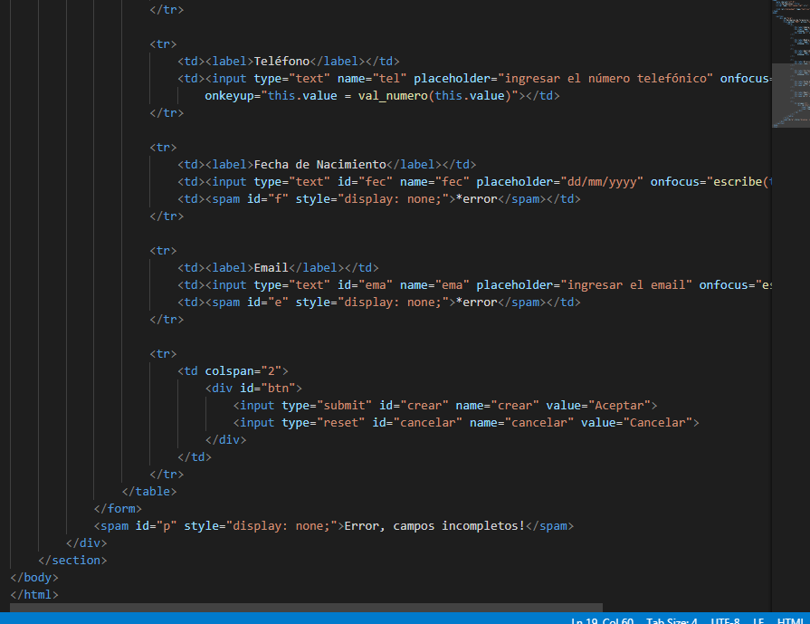 
<strong>•CAPTURAS DEL CODIGO JAVASCRIPT DE LA VALIDACION</strong> 
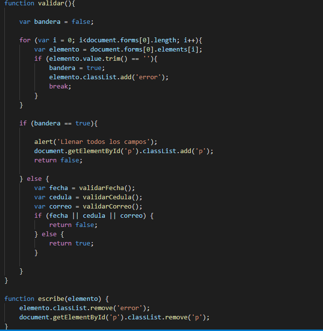 
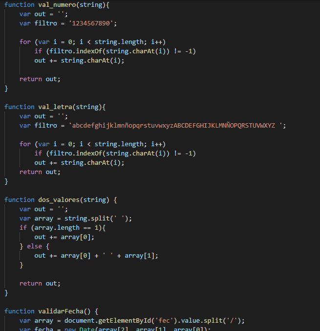 
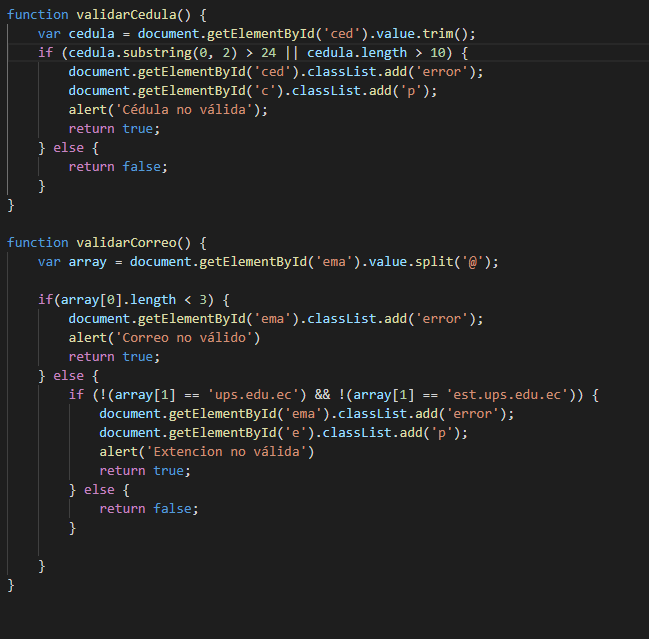 
<strong>•RESULTADO FINAL DE LA VALIDACION</strong> 
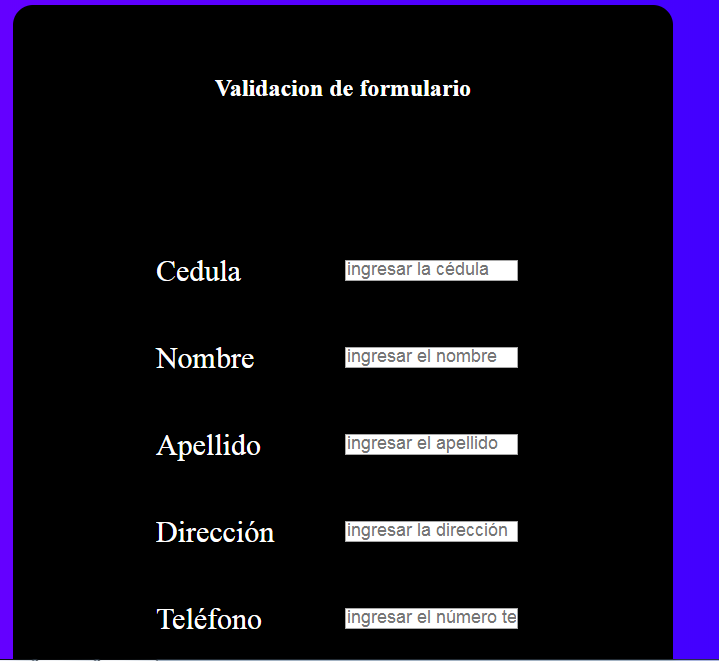 
<strong>•CODIGO HTML DE LA GALERIA</strong> 
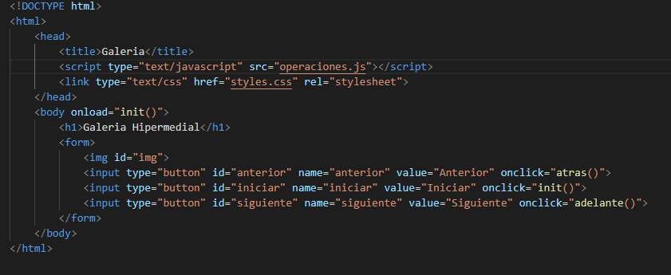 •CAPTURAS DEL CODIGO JAVASCRIPT DE LA GALERIA</strong> 
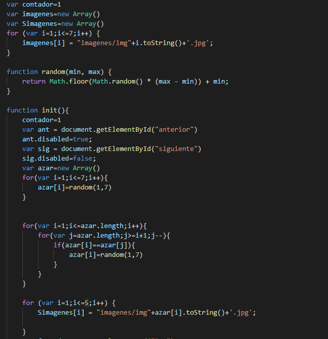 
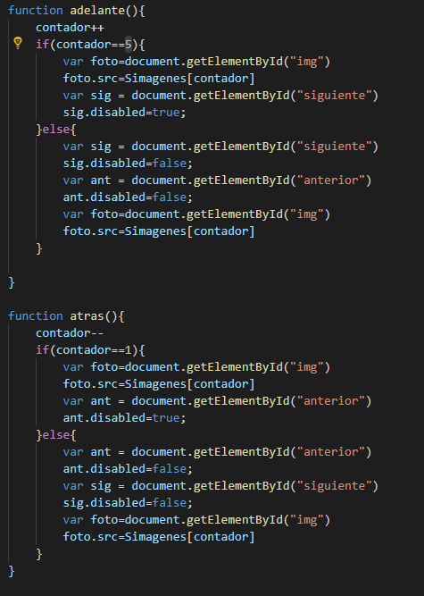 
<strong>•RESULTADO FINAL DE LA GALERIA</strong> 
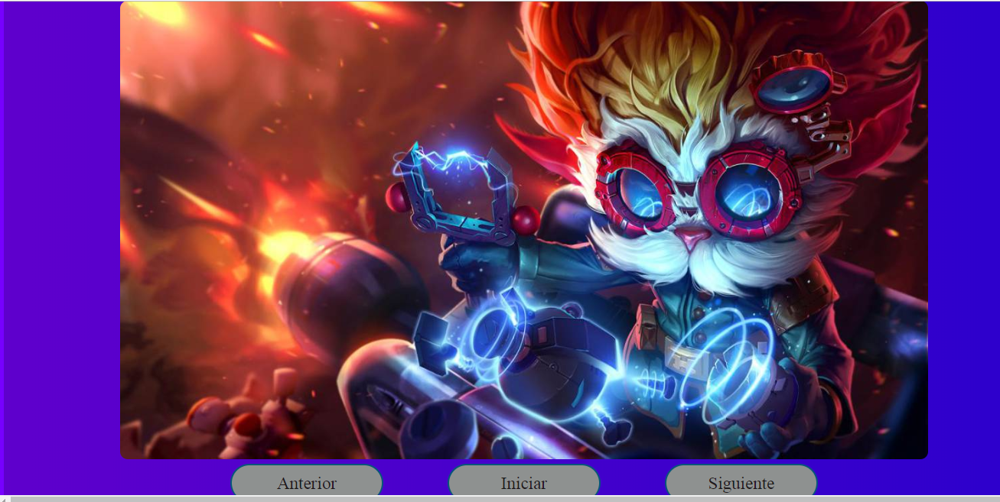 
